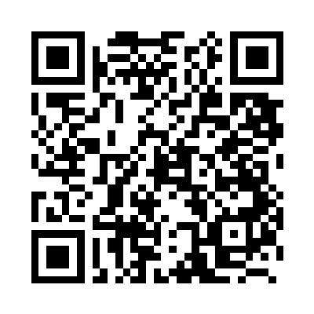

# ID Verification Service — mini-app example

A single-file demo mini-app showing a **service with a human step**: the user
submits a document, books a video call, pays — and the deliverable (a public
certificate link) arrives *after* an out-of-band interaction, not instantly.
Published at **https://apps.freeport.network/id-verification/**.

Try it: Freeport app → **Apps** tab → **Add App** → scan the QR below (or the
**QR button** in the add sheet), or paste `apps.freeport.network/id-verification`
(the repo's GitHub URL works too):

(Requires **Mini-apps** enabled in Settings → Experimental.)

Flow:

1. **Pick a service** — Validate ID (**free**, so the full flow can be tested
   without funds) or Validate licence (**1 USDT**).
2. **Application form** — legal name, document number, date of birth, and a
   **photo of the document** (file upload; a canvas-drawn specimen is available
   so the demo never needs a real ID). The user's **npub** — from
   `window.nostr.getPublicKey()` — is attached to the application so the
   certificate can be bound to their Freeport identity. The photo never leaves
   the page in this demo.
3. **Book a video call** — pick a day (next 3 days) and a time slot, shown in
   the local timezone. A real service would verify the document and the
   applicant's likeness on this call.
4. **Order confirmation** — a summary card (service, applicant details, npub,
   document thumbnail, call time, fee) with a **Pay & schedule call** button:
   `window.freeport.paySpark({token: {ticker: 'USDT', amount}})` to a donation
   Spark address. The free service skips the payment and schedules directly.
5. **Certificate** — after the call, the verifier publishes
   `https://idcert.com/freeport/<CODE>` (6-char code, deterministically derived
   from npub + document number in the demo). The user copies it onto their
   Freeport profile as a link, so counterparties can check the verified legal
   name behind the npub before dealing. The demo has a *simulate verified call*
   button in place of the real call.

Everything is fake: no verification happens, `idcert.com` is a fictional
domain, and the payment goes to a demo address. The page is fully
self-contained (bech32 npub encoder included) and works as a plain website
outside the shell, where it shows instructions instead of the service.

Full bridge architecture & threat model:
[`docs/miniapps-security.md`](../../docs/miniapps-security.md).
